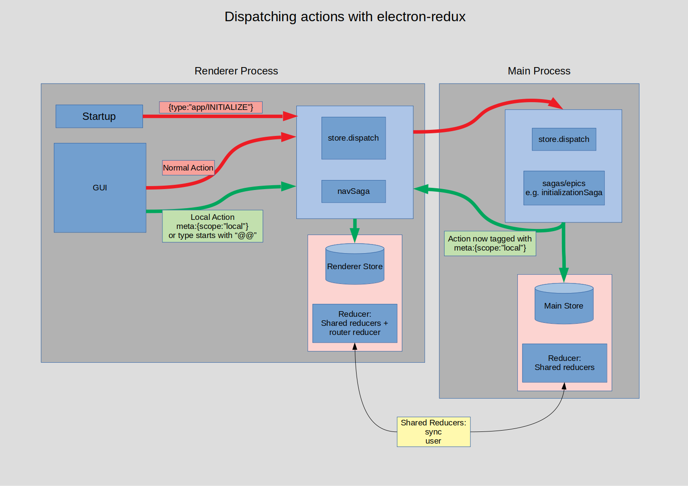

# The electron-redux architecture of pshare

## Intro

pshare is a redux-react powered electron application with a split-brain. Electron apps are composed of **main process** and **renderer process**, and each process has differing capabilites / responsibilities.

## Renderer responsibilities

The **renderer process** is responsible for the GUI **only**, and should not make any network calls.

## Main process responsibilities

The **main process** is responsible for spawning the **renderer process** and is able to interact with the network (including network connections to localhost, which are critical for RPC)

## Communication between main and renderer processes

The only means of communication between **main process** and **renderer process** is via IPC with ***serialized*** messages (this is important to remember, as it means that all messages that cross this boundary must be serializable).

## Client/Server architectures == distributed application == (bad?)

One way to give the renderer process access to the network calls is to set up the main process as a (kind-of) "service-provider" server with one channel with which renderer can request data from the main, and another channel in the other direction for event data pushed from the main process. This would provide complete separation of renderer and main processes, distributing application logic between two distinct, autonomous parts. Further work would be required to maintain proper synchronization of these parts.

## The electron-redux way

By using electron-redux, we can make much of this inter-application boundary disappear, and have both renderer and main processes behave as if they belong to a single redux application. This should greatly simplify application development.

### electron-redux is really simple

The core concept of electron-redux is very straightforward. Any actions dispatched to any store will be diverted first into the redux store of the main process, then echoed into the store of the renderer process.

### The stores are running the same reducers

The stores themselves are running reducers that are shared between main and renderer processes, meaning that they each hold a copy of the current application state (with the renderer process store becoming *eventually* consistent with the main process store... but this is instant!), constructed from the determistic flow of actions from main store --> renderer store.

### How actions flow

## How do we perform network IO?

For actions that trigger network IO, this gives us the ability to perform network IO side-effects in the main process, and seamlessly post the resulting actions into the renderer process store. 

### Attaching sagas to only one of the stores

By attaching sagas that deal with this network IO **only** to the main store, we can interact with them from the renderer process *as if they running in the renderer process*. Everything is now effectively a single redux application.

## What are the disadvantages of electron-redux

There are a few gotchas when dealing with electron-redux

1. All actions ***must*** be **Flux Standard Actions**. Action-creators must be used, and we will be using the `typesafe-actions` package to generate these creators. See [below](#defining-actions) for more info. 
   
2. All actions must be serializable as they well be posted across process boundaries via IPC. Sometimes it is possible to accidentally attach DOM events to actions by

       <button onClick={userAgreeSync}>Agree to sync?</button>
       //calls userAgreeSync(clickEvent)... now our payload is a DOM event

   instead of

       <button onClick={() => userAgreeSync()}>Agree to sync?</button>
       //definitely no payload

   Watch out!

3. For unknown reasons, electron-redux filters out action-types which start with the characters `@@` (for instance `@@app/SOMETHING`) and these are not forwarded to the main store. We should not be using the `@@` prefix for our actions, despite earlier versions of the app using this convention. Similarly, it is possible to bypass electron-redux by adding the following metadata to the action:

       { scope : "local" }

   For normal app development, using this feature should not be necessary, and may lead to divergent state between main and renderer processes.

4. We are using `connected-react-router` to handle navigation. This dispatches actions prefixed with `@@` and (for reasons stated above) these are excluded from the main store. As such, the root state of the renderer store includes an extra `router` property that is not included in the root state of the main store, and navigation actions can **only** be dispatched from the renderer. The final design of the navigation is yet to be finalized. More information about this [below](#navigation).

## How does this change things for redux developers?

### React components

These remain unchanged as the model they see is unchanged from pre-electron-redux.

### Actions

For normal UI actions, things won't be much different (but remember, in the background, these actions will first be processed in the main store, then posted into the renderer store, but this is irrelevant). Actions that request network IO should be received in sagas attached to the main store. There's more info about how this is set-up [here](#network-io).

### Defining actions

To set up additional actions, please look at [`src/shared/actions/index.ts`](../src/shared/actions/index.ts) and (for example) [`src/shared/actions/sync.ts`](../src/shared/actions/sync.ts) as an example of how to proceed.

### Network IO

For network IO, sagas can be attached to the main store from [`src/main/sagas/index.ts`](../src/main/sagas/index.ts), and a fully annotated saga can be found at [`src/main/sagas/initializationSaga/index.ts`](../src/main/sagas/initializationSaga/index.ts)

### Defining reducers

To add reducers, start at [`src/shared/reducers/index.ts`](../src/shared/reducers/index.ts), then use (for example) [`src/shared/reducers/sync.ts`](../src/shared/reducers/sync.ts) as a template to work from. By including your reducer in [`src/shared/reducers/index.ts`](../src/shared/reducers/index.ts), it will be combined into both main and renderer reducers. This would be the normal set-up.

### Navigation

TBD. For the time-being, navigation is orchestrated by a managing saga that is attached only to the renderer store. The saga is [`src/renderer/sagas/navSaga.ts`](src/renderer/sagas/navSaga.ts) and, in response to actions such as `sync/WAITING_FOR_SYNC`, navigates to pages that have been set up in [`src/renderer/routes/index.tsx`](src/renderer/routes/index.tsx). We will likely need to revisit this when we start the on-boarding epic.